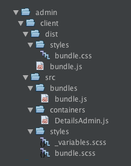

# About this module

## Introduction

This is a simple module that works similar to ModelAdmin, but instead of editing all records for a given DataObject, it displays a Details form for one single record - equivalent to SiteConfig. It was built primarily for the purpose of finding out how React works in the SilverStripe 4 CMS. 

At the time of writing, only the `Campaigns` and `Files` sections have been converted to React. GridField hasn't been converted yet, so it can't be used for related records just yet, for now making the module less usable...

## 1. Setup

The module has been setup close to the SilverStripe way of doing things:

### Folder structure for React

For frontend development the React source lives in `client\src` and the resulting bundles are found in `client\dist`. For admin applications, the client folder structure is placed within an `admin` folder, as shown below.

By default SilverStripe generates separate css files for its modules, instead of incorporating styles in JavaScript, and this module follows that example. So there is a `bundle.js` as well as a `bundle.css`. To generate the separate css file, `extract-text-webpack-plugin` is used, that will extract the css from javascript after it has been generated. 

**Note**: although at this point the module doesn't need extra styling, the style files are there to serve as an example.

### package.json

It's up to the developer to define what Node packages they actually want to include in package.json. This works for the current module.

### @SilverStripe/webpack-config

SilverStripe has built an NPM module @SilverStripe/webpack-config, that takes away the hassle of connecting to SilverStripe modules, and does some other configuration, leaving you with a relatively simple webpack configuration for the module. You don't have to use it, but it is sort of comfortable. 

@SilverStripe/webpack-config also prepares for development ánd production. The latter is controlled by setting  `process.env.NODE_ENV` to either 'production' or something else ('development'). In this case package.json is used to set the environment:

	"scripts": {
		"production": "NODE_ENV=production webpack",
		"watch": "NODE_ENV=development webpack --watch",
		"once": "NODE_ENV=development webpack"
	},
	
**Note: that these are just examples that happen to work for me on OSX, please feel free to disagree, do things differently and maybe tell me :)**

When `development` is set, @silverstripe will generate map files for use with React dev tools

When `production` is set, @SilverStripe/webpack-config sets up and enforces ESlint to check and format the  code. 

### ESlint config
For ESlint to actually work, an `.eslintrc` config file is required. It could just return the existing config in @silverstripe/webpack-config, but if it moans about the *window* variable not being global, setting 'browser' to true in silverstripeConfig.env seems to help:

	var silverstripeConfig = require('@silverstripe/webpack-config/.eslintrc');

	silverstripeConfig.env = {
	    'jasmine': true,
	    'browser': true, 
	};

	module.exports = silverstripeConfig

### webpack.config: admin area or frontend

When @SilverStripe/webpack-config is used, the resulting webpack.config.js for this module can be fairly simple. The current config is aimed at admin development, but it is easy to change it to frontend by changin `PATHS.ADMIN` to `PATH.MODULE`. 

## 2. How this module works
**The main README.MD file explains how to use the module. This section is about how it functions internally. Basically the Form and FormActions are defined in DetailsAdmin.php - a LeftAndMain extension. This file then  writes some JavaScript to the page, that can be used by React to actually build and manage the form. SilverStripe provides the React components for that to work.**

There are two things to this module:

* Building an Admin React module (the primary goal)
* Building an Admin Section module that can be extended (secondary niceness)

There are two php classes to this module: `DetailsAdmin` and `DetailsAdminPermissions`. The first abstract class is the actual module, the second is a helper class.

### DetailsAdmin.php

This abstract Admin Section base class has the following methods:

* **getDetailsEditForm**: builds the edit form for the details of the first record of a DataObject. When there is no such record, it is created first.
* **detailsEditForm**: is called when the form is posted. Basically refers to `getDetailsEditForm`
* **save**: saves the record
* **getClientConfig**: provides javascript settings for this section that will be injected in the page so they can be used by React

**Check out a couple of neat things in `getDetailsEditForm` that will actually make the form shine:**

Set the shape of the 'save' button to respond nicely to the state of the form:

    FieldList::create(
        FormAction::create('save', _t(__CLASS__ . 'SAVE', 'Save'))
            ->setIcon('save')
            ->setSchemaState([
                'data' => [
                    'pristineTitle' => _t(__CLASS__ . 'SAVED', 'Saved'),
                    'pristineIcon' => 'tick',
                    'dirtyTitle' => _t(__CLASS__ . 'SAVE', 'Save'),
                    'dirtyIcon' => 'save',
                    'pristineClass' => 'btn-outline-primary',
                    'dirtyClass' => '',
                ],
            ])
    ),
    
Confirm if the user wants to leave the page if changes have been made to the form.
 
     $form->setNotifyUnsavedChanges(true);
 
Make the form respond to validation errors with form schema if requested via react.

    $form->setValidationResponseCallback(function (ValidationResult $errors) use ($form, $id, $record) {
        $schemaId = Controller::join_links(
            $this->Link('schema'), 'detailsEditForm', $id
        );
        return $this->getSchemaResponse($schemaId, $form, $errors);
    });
    

*Note that, although we're preparing a regular SilverStripe form, it will need React to display it. If you want the forms to be generated without React as well, use editForm() and getEditForm() instead and SilverStripe will automatically build it. But it seems kind of superfluous to build the same for twice...*

### DetailsAdminPermissions.php

This is a simple helper class. Because `DetailsAdmin` is an abstract class, just like ModelAdmin, it can't implement PermissionProvider so someone else needs to do that for them. In the case of ModelAdmin the helper is LeftAndMain, but in this case `DetailsAdminPermissions` does the work.

***Note:** DetailsAdmin is an abstract class because it is just a base class: only its extensions should appear in the CMS Menu, not the base class itself!*

## 3. React

### Initial state

In `DetailsAdmin::getClientConfig()` we define an array of data we will need for the React module to function and merge it with the existing array. The complete array for all sections will be injected into the page in de global `window.ss.config.sections` variable, and automatically read into `initial state`. SilverStripe will handle that for us.

    public function getClientConfig()
    {
        $treeClass = Config::inst()->get(get_class($this), 'tree_class');
        $name = $treeClass::singleton()->i18n_singular_name();

        return array_merge(parent::getClientConfig(), [
            'reactRouter' => true,
            'detailsAdmin' => true,
            'treeClassTitle' => $name,
            'form' => [
                'detailsEditForm' => [
                    'schemaUrl' => $this->Link('schema/detailsEditForm')
                ],
            ],
        ]);
    }

* **reactRouter**: default data - setting this to `true` tells SilverStripe to use the ReactRouter. This will connect our React Module to the current Admin section.
* **schemaUrl**: default data - tells React router where to post the form
* **treeClassTitle**: custom data - a nice name for the current Admin section
* **detailsAdmin**: custom solution - to tell React that we're in an admin section generated by DetailsAdmin. We need this to register the current section with React Router, and to find the correct data for rendering the form. 

### ConfigHelpers

**Config** is a SilverStripe React module used to read the (window.ss.config) data from file. We import and use it in the React 'root' file `src/bundles/bundle.js` to get to the config for the current section.

	import ConfigHelpers from 'lib/Config';

* **ConfigHelpers.get('sections')**: get the config for a certain key from the total config, in this case 'sections', retreiving all sections.
* **ConfigHelpers.getAll()**: get the entire config from window.ss.config
* **ConfigHelpers.getSection('CampaignAdmin')**: get the config for one section, in this case CampaignAdmin.
* **ConfigHelpers.getCurrentSection()**: `Bummer, this doesn't do anything yet, and we could actually use it!`

### Registering the current DetailsAdmin
*admin/client/src/bundles/bundle.js*

To register the current DetailsAdmin (there can be more then one for separate DataObjects), we need to know the current section name. And that isn't possible out of the box. DetailsAdmin::getClientConfig() will just add the information about each section to *window.SilverStripe.config.sections.[sectionname]>*. But we can't add anything else that way.

So it was (temporarily) added 'manually' to the `windows.ss.config` root as `currentDetailsAdmin` using init(): 

    protected function init()
    {
        ...
        Requirements::customScript('window.ss.config.currentDetailsAdmin = "' . get_class($this) . '"');
    }

Now we can register the current DetailsAdmin section like this in `bundle.js` (where DetailsAdmin.js is our actual Component):

    import { withRouter } from 'react-router';
    import reactRouteRegister from 'lib/ReactRouteRegister';
    import ConfigHelpers from 'lib/Config';

    import DetailsAdmin from '../containers/DetailsAdmin';

    document.addEventListener('DOMContentLoaded', () => {
      const sectionName = ConfigHelpers.get('currentDetailsAdmin');
      const sectionConfig = ConfigHelpers.get('sections').find((section) => (
          section.name === sectionName
      ));
      reactRouteRegister.add({
        path: sectionConfig.url,
        component: withRouter(DetailsAdmin),
      });
    });

*At this point we do not need to change state, so we can skip the reducer for now, and I'm not yet sure how to 'share' a single reducer between multiple sections, so that's for later.*

### The React DetailsAdmin Component
*admin/client/src/containers/DetailsAdmin.js*

The code above imports the React `DetailsAdmin module`, that is responsible for displaying and handling the form. Tis isn't all that difficult - the challenge is to display the right form for any current section - as we do not know what specific DetailsAdmin section we're in (ConfigHelpers.getCurrentSection() not working). Anyway, first: the setup.

#### Imports
	import React, from 'react';
	import PropTypes from 'prop-types';
	import { connect } from 'react-redux';
	import { withRouter } from 'react-router';
	import Toolbar from 'components/Toolbar/Toolbar';
	import FormBuilderLoader from 'containers/FormBuilderLoader/FormBuilderLoader';

`Toolbar` and `FormBuilderLoader` are SilverStripe React components, that are accessible because of the externals in @silverstripe/webpack-config. Check `node-modules/@silverstripe/webpack-config/js/externals.js` for available components and how to access them.

#### Mapping state to props
The config settings from window.SilverStripe are automatically placed in state. `mapDispatchToProps` isn't used yet but for some reason still needs to be there. `mapStateToProps` just sets (parts of) the state to be a prop in the DetailsAdmin component.

    function mapDispatchToProps() {
      return {};
    }

    function mapStateToProps(state) {
      const sectionName = state.config.currentDetailsAdmin;    
      const sectionConfig = state.config.sections.find((section) => (
          section.name === sectionName
      ));

      return {
        sectionConfig,
      };
    }

#### Defaults and proptypes

    DetailsAdmin.propTypes = {
      sectionConfig: PropTypes.object,
    };

    DetailsAdmin.defaultProps = {
      sectionConfig: {},
    };
    

#### Rendering DetailAdmin

This is really a very simple stateless functional component at this point. But as it is bound to be extended at some point, it might need to be set up as a class later. At this point ESlint wouldn't allow that :) 

The SilverStripe `FormBuilderLoader` is reponsible for building the form, so we don't have to bother at all here.

    const DetailsAdmin = props => (
      

        <Toolbar>
          <h2>{props.sectionConfig.treeClassTitle}</h2>
        </Toolbar>
        

          <FormBuilderLoader
            schemaUrl={props.sectionConfig.form.detailsEditForm.schemaUrl}
          />
        

      

    );

*Note that the Toolbar is used to display the DataObject title, where it would normally display the BreadCrumbs.*

